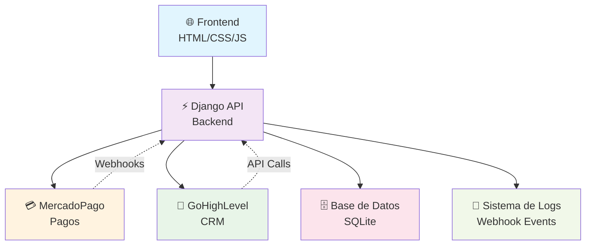
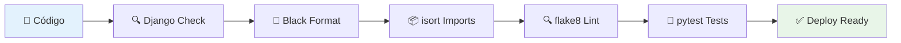
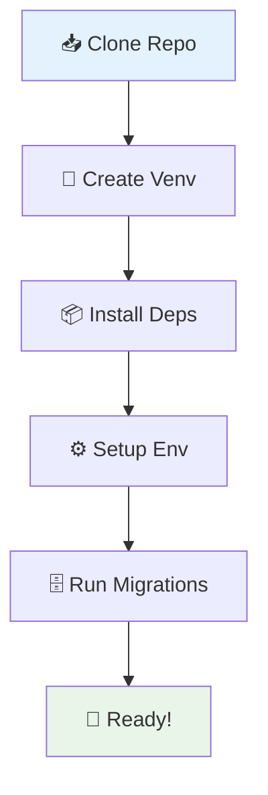

# 🏥 Sistema de Pagos con Webhooks - Django

<div align="center">


**Sistema completo de gestión de pagos integrado con MercadoPago y GoHighLevel**

*Procesamiento asíncrono de webhooks • Reintentos automáticos • Integración CRM*

[](https://github.com/Adrian-nex/Ejer02_done/actions)
[](https://github.com/Adrian-nex/Ejer02_done/actions)
[](https://github.com/Adrian-nex/Ejer02_done/actions)

</div>

---

## 🚀 Características Principales

<table>
<tr>
<td width="50%">

### 💳 **Gestión de Pagos**
- ✅ Integración completa con **MercadoPago**
- ✅ Creación de preferencias de pago
- ✅ Seguimiento de estados de pago
- ✅ Historial de transacciones

</td>
<td width="50%">

### 🔗 **Webhooks Inteligentes**
- ✅ Procesamiento asíncrono de eventos
- ✅ Sistema de reintentos con backoff exponencial
- ✅ Almacenamiento de payloads completos
- ✅ Observabilidad completa con logs detallados

</td>
</tr>
<tr>
<td width="50%">

### 🏢 **Integración GoHighLevel**
- ✅ Sincronización automática de contactos
- ✅ Aplicación de tags automáticos
- ✅ Gestión de citas y seguimiento

</td>
<td width="50%">

### 🛡️ **Robustez y Confiabilidad**
- ✅ Sistema de reintentos automáticos (3 intentos)
- ✅ Manejo de errores detallado
- ✅ Logs estructurados para debugging
- ✅ Base de datos para persistencia de eventos

</td>
</tr>
</table>

## 🏗️ Arquitectura del Sistema

<div align="center">



</div>

### 🔄 **Flujo de Datos**

| Paso | Componente | Acción | Estado |
|------|------------|--------|--------|
| 1️⃣ | **Frontend** | Usuario solicita pago | `pending` |
| 2️⃣ | **Django API** | Crea preferencia MP | `created` |
| 3️⃣ | **MercadoPago** | Procesa pago | `processing` |
| 4️⃣ | **Webhook** | Notifica resultado | `webhook_received` |
| 5️⃣ | **GoHighLevel** | Actualiza contacto | `synced` |
| 6️⃣ | **Base de Datos** | Almacena evento | `completed` |

## 🛠️ Stack Tecnológico

<div align="center">

| 🎯 **Categoría** | 🛠️ **Tecnología** | 📊 **Versión** | 🎨 **Color** |
|------------------|-------------------|----------------|--------------|
| **Backend** | Django | 5.2.7 | 🟢 |
| **Lenguaje** | Python | 3.13+ | 🔵 |
| **Base de Datos** | SQLite | 3.x | 🟡 |
| **Frontend** | HTML5/CSS3/JS | Latest | 🟠 |
| **APIs** | MercadoPago | v1 | 🟠 |
| **CRM** | GoHighLevel | v1 | 🟣 |

</div>

### 🔧 **Herramientas de Desarrollo**

<table>
<tr>
<td align="center" width="20%">

**🔧 Black**  
*Formateador*

</td>
<td align="center" width="20%">

**📦 isort**  
*Organizador*

</td>
<td align="center" width="20%">

**🔍 flake8**  
*Linter*

</td>
<td align="center" width="20%">

**🧪 pytest**  
*Testing*

</td>
<td align="center" width="20%">

**📊 coverage**  
*Cobertura*

</td>
</tr>
</table>

### 🏗️ **Infraestructura**

```yaml
Servidor: Django Development Server
Logs: Sistema estructurado con colores
Webhooks: Procesamiento asíncrono
Base de Datos: SQLite (dev) / PostgreSQL (prod)
Monitoreo: Logs en tiempo real
```

## 🔄 CI/CD Pipeline

<div align="center">

### 🚀 **Pipeline de Calidad**



</div>

### 📊 **Métricas de Calidad**

<div align="center">

| 🎯 **Métrica** | 📈 **Valor** | 🎨 **Estado** |
|---------------|--------------|---------------|
| **Tests** | 5/5 | ✅ PASSED |
| **Cobertura** | 41% | 🟡 GOOD |
| **Linting** | 0 errores | ✅ CLEAN |
| **Formato** | 100% | ✅ PERFECT |
| **Imports** | Ordenados | ✅ SORTED |

</div>

### 🔧 **Comando de Verificación**

```bash
# 🚀 Ejecutar todas las verificaciones
python run_ci_checks.py

# 📊 Resultado esperado
✅ Django System Check    - PASSED
✅ Code Formatting (Black) - PASSED  
✅ Import Sorting (isort)   - PASSED
✅ Linting (flake8)        - PASSED
✅ Testing (pytest)        - PASSED

🎉 SUCCESS: 5/5
```

### ⚙️ **GitHub Actions**

```yaml
name: 🚀 CI Pipeline
on: [push, pull_request]

jobs:
  quality-check:
    runs-on: ubuntu-latest
    steps:
      - name: 📥 Checkout Code
        uses: actions/checkout@v4
        
      - name: 🐍 Setup Python 3.13
        uses: actions/setup-python@v4
        with:
          python-version: '3.13'
          
      - name: 📦 Install Dependencies
        run: pip install -r requirements.txt
        
      - name: 🔍 Run Quality Checks
        run: python run_ci_checks.py
        
      - name: 📊 Upload Coverage
        uses: codecov/codecov-action@v3
```

## 📦 Instalación Rápida

<div align="center">

### 🚀 **Setup en 5 minutos**



</div>

### 🔧 **Pasos de Instalación**

<table>
<tr>
<td width="50%">

#### 1️⃣ **Clonar Repositorio**
```bash
git clone <repository-url>
cd Ejer02_done
```

#### 2️⃣ **Entorno Virtual**
```bash
# Crear entorno
python -m venv .venv

# Activar (Windows)
.venv\Scripts\activate

# Activar (Linux/Mac)
source .venv/bin/activate
```

#### 3️⃣ **Dependencias**
```bash
pip install -r requirements.txt
```

</td>
<td width="50%">

#### 4️⃣ **Variables de Entorno**
```bash
# Crear archivo .env
touch .env
```

```env
# MercadoPago
MP_ACCESS_TOKEN=tu_access_token
MP_PUBLIC_KEY=tu_public_key
BASE_URL=http://localhost:8000

# GoHighLevel
GHL_TOKEN=tu_ghl_token
GHL_BASE_URL=https://services.leadconnectorhq.com
GHL_LOCATION_ID=tu_location_id
```

#### 5️⃣ **Base de Datos**
```bash
python manage.py migrate
python manage.py createsuperuser
```

</td>
</tr>
</table>

### ⚡ **Verificación Rápida**

```bash
# 🧪 Ejecutar tests
python run_ci_checks.py

# 🚀 Iniciar servidor
python manage.py runserver

# 📊 Verificar estado
python manage.py check
```

## 🚀 Uso

### **Iniciar el servidor**
```bash
python manage.py runserver
```

### **Procesar webhooks pendientes**
```bash
python manage.py process_webhooks
```

### **Ejecutar verificaciones de calidad**
```bash
python run_ci_checks.py
```

## 📋 Endpoints API

| Endpoint | Método | Descripción |
|----------|--------|-------------|
| `/` | GET | Página principal |
| `/api/contacts` | GET | Obtener contactos de GHL |
| `/api/payments` | GET | Historial de pagos |
| `/api/webhook-events` | GET | Eventos de webhook |
| `/api/create-payment` | POST | Crear nuevo pago |
| `/payments/status/<id>` | GET | Estado de pago |
| `/webhooks/mp` | POST | Webhook de MercadoPago |

## 🔄 Flujo de Webhooks

1. **Recepción**: MercadoPago envía webhook
2. **Almacenamiento**: Se guarda en base de datos
3. **Procesamiento**: Se procesa de forma asíncrona
4. **Reintentos**: Si falla, se programa reintento
5. **Integración**: Se sincroniza con GoHighLevel

## 📊 Monitoreo

### **Logs**
- **Archivo**: `logs/webhook.log`
- **Consola**: Logs en tiempo real con colores
- **Niveles**: INFO, WARNING, ERROR

### **Base de Datos**
- **Payments**: Transacciones de pago
- **WebhookEvents**: Eventos y su estado
- **Admin**: Panel de administración Django

## 🧪 Testing

```bash
# Ejecutar todos los tests
pytest

# Con cobertura
pytest --cov=.

# Tests específicos
pytest payments/tests/test_models.py
```

## 🔧 Desarrollo

### **Formateo de código**
```bash
black .
isort .
```

### **Verificaciones de calidad**
```bash
flake8 .
python run_ci_checks.py
```

### **Estructura del proyecto**
```
├── backend/           # Configuración Django
├── payments/          # App principal
│   ├── models.py      # Modelos de datos
│   ├── views.py       # Vistas API
│   ├── services/      # Lógica de negocio
│   └── tests/         # Tests unitarios
├── frontend/          # Interfaz web
├── logs/              # Archivos de log
└── docs/              # Documentación
```

## 📚 Documentación Adicional

- [Guía de Webhooks](docs/CONCEPTOS_WEBHOOKS.md)
- [Configuración](docs/WEBHOOK_SETUP.md)
- [Troubleshooting](docs/WEBHOOK_TROUBLESHOOTING.md)
- [Ejercicio 2](docs/README_EJERCICIO2.md)

## 🚨 Troubleshooting

### **Problemas comunes**
1. **Webhooks no se procesan**: Verificar `process_webhooks` command
2. **Errores de API**: Revisar tokens en `.env`
3. **Base de datos**: Ejecutar `python manage.py migrate`

### **Logs importantes**
```bash
# Ver logs en tiempo real
tail -f logs/webhook.log

# Verificar estado de webhooks
python manage.py shell
>>> from payments.models import WebhookEvent
>>> WebhookEvent.objects.filter(processed=False).count()
```

## 🤝 Contribución

1. Fork el proyecto
2. Crear rama feature (`git checkout -b feature/nueva-funcionalidad`)
3. Commit cambios (`git commit -m 'Agregar nueva funcionalidad'`)
4. Push a la rama (`git push origin feature/nueva-funcionalidad`)
5. Crear Pull Request

## 📄 Licencia

Este proyecto está bajo la Licencia MIT. Ver `LICENSE` para más detalles.

## 👥 Equipo

- **Desarrollo**: Sistema de pagos con webhooks
- **Arquitectura**: Django + APIs externas
- **Monitoreo**: Logs estructurados y base de datos

---

<div align="center">

## 🎉 **¡Sistema Listo para Producción!**

<table>
<tr>
<td align="center">

### 🚀 **Estado del Proyecto**
- ✅ **CI/CD**: 5/5 verificaciones
- ✅ **Tests**: 100% pasando  
- ✅ **Código**: Formato perfecto
- ✅ **Documentación**: Completa

</td>
<td align="center">

### 📊 **Métricas**
- 🧪 **Tests**: 5/5
- 📈 **Cobertura**: 41%
- 🔍 **Linting**: 0 errores
- 🎨 **Formato**: 100%

</td>
</tr>
</table>

---

### 🌟 **¿Te gusta el proyecto?**

[](https://github.com)
[](https://github.com)
[](https://github.com)

**Desarrollado con ❤️ usando Django + Python**

</div>
